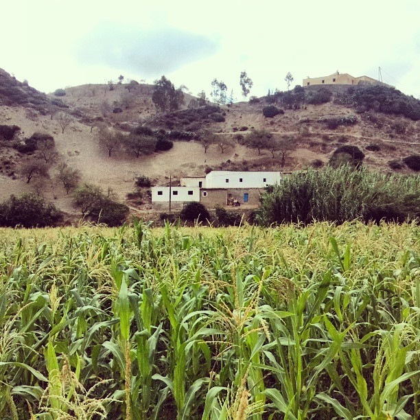

### Hi there 👋 who I am?

- :computer: I’m using [Ubuntu 20.04][ubuntu20_04]
- 👯 I’m looking to collaborate on Django projects
- 📫 How to reach me via:
  - [Linkedin][myLinkedinPage]
  - Per Post: Bei den Birken 8, 87435 Kempten (Germany) 
- ⚡ A fact about me: I was born at home (pic below) in the [Rif][Riflink] & I'm proud of it

### My cheat sheets

* [Markdown (.MD files)](my_cheat_sheets/markdown/README.md)
* [Git & GitHub](my_cheat_sheets/git/README.md)
* [Python](my_cheat_sheets/python/README.md)
* [Django](my_cheat_sheets/django/README.md)
* [HTMX](my_cheat_sheets/htmx/README.md)
* [PostgreSQL](my_cheat_sheets/postgresql/README.md)
* [Linux terminal](my_cheat_sheets/linux/README.md)

### Deployment platforms

<!-- links used in this file -->
[Riflink]:https://en.wikipedia.org/wiki/Rif
[myLinkedinPage]:https://www.linkedin.com/in/ramiboutas/
[ubuntu20_04]:https://releases.ubuntu.com/20.04/
