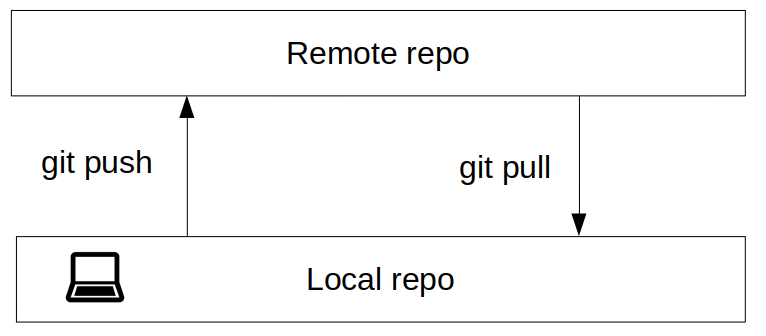
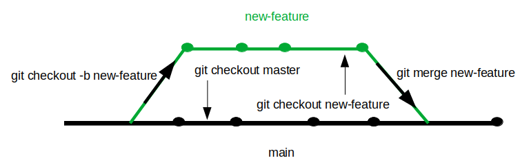

# Git & GitHub - Quick guide
This just to get the most relevant commands. Its purpose it not that you undersand how Git or Github works, but to look up for a command if you forgot any instructions.

### Concepts
* Git: [https://git-scm.com/](https://git-scm.com/)
* Repo: repository
* Remote repo: a repo on the internet (on GitHub for instance)

### Clone a repository

* Clone a remote repo to a local PC: `git clone <ressoure>`

### Adding & commiting changes

* Adding files to staging area
  - One file: `git add <file>`
  - All files & folders in the current folder: `git add . `
* Commit Changes: `git commit -m "{description of changes}"`
* Adding & Commiting: `git commit -am "{description of changes}"`

### Updating the remote repo and getting updates from it - [Image](images/pushpull.png)

* Updating the repo (for the first time): `git push -u origin <branch_remote_repo>`
* Updating the repo: `git push`
* Getting the updates (other contributors did some changes and you need the last update): `git pull`

###  Status, log and reset commands

* See the status of the repo: `git status`
* Check last commits with Commit ID, Author & date: `git log`
* Return to a previous commit: `git reset --hard <commitID>`
* Come back to the remote repo:  `git reset --hard origin/<branch_remote_repo> `

### Branching - [Image](images/branching.png)

* Get all the branches you have and points out in which one you're working on: `git branch`
* Create a new branch: `git checkout -b <new_branch>`
* Switch branch  `git checkout <branch_to_go>`
* Merge branches (when located on master/main branch): `git merge <feature_branch>`

