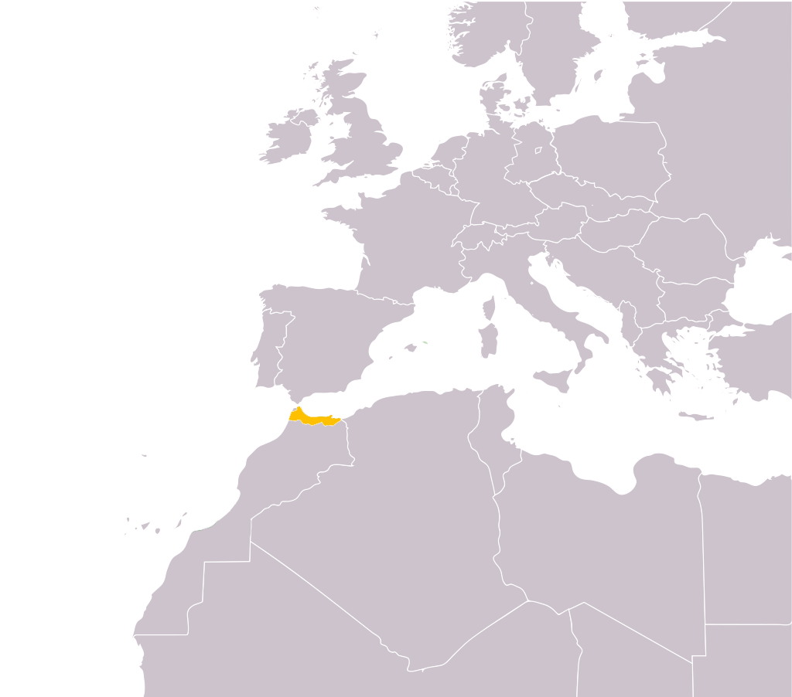

# Purpose
Here I am just describing relevant aspects of Markdown texts

# Table of contents
1. [Headings](#headings)
2. [Lists](#lists)
    * [Unordered lists](#unorderedlists)
    * [Ordered lists](#orderedlists)
    * [List inside a list](#listinsidealist)
3. [Cites](#cites)
4. [Links](#links)
   * [Working with clean links with variables](#linkvariables)
5. [Images](#images)
   * [Take advantage of the HTML attributes](#HTMLattributes)
6. [Special characters](#specialcharacters)

## Headings <a name="headings"></a>

* # Heading 1: `# Heading 1` (similar to `<h1>` in HTML)
* ## Heading 2: `## Heading 2` (similar to `<h2>` in HTML)
* ### Heading 3: `### Heading 3` (similar to `<h3>` in HTML)
* #### Heading 4: `#### Heading 4` (similar to `<h4>` in HTML)
* ##### Heading 5: `##### Heading 5` (similar to `<h5>` in HTML)
* ###### Heading 6: `###### Heading 6` (similar to `<h6>` in HTML)


## Text formats <a name="textformats"></a>

* __Bold text__ : `__Bold text__`
* *Italic text*: `*Italic text*`
* __bold text but with _italic text_ inside__ : `__bold text but with _italic text_ inside__`
* There are other ways to do the last one but personally I'll stick with this one :)


## Lists <a name="lists"></a>

### Unordered lists <a name="unorderedlists"></a>

If I write:
```
* Item 1
* Item 2
* Item 3
```
or
```
+ Item 1
+ Item 2
+ Item 3
```
or even
```
- Item 1
- Item 2
- Item 3
```

I will see:
* Item 1
* Item 2
* Item 3

### Ordered lists <a name="orderedlists"></a>

Here you need just to put numbers with a dot

```
1. Item 1
2. Item 2
3. Item 3
```

And you see the following:

1. Item 1
2. Item 2
3. Item 3

### List inside a list <a name="listinsidealist"></a>

You can also stuff like this:
```
1. Item 1
   1. Subitem 1.1
   2. Subitem 1.2
2. Item 2
   - Subitem one
   - Subitem two
```
And you'll get:
1. Item 1
   1. Subitem 1.1
   2. Subitem 1.2
2. Item 2
   - Subitem one
   - Subitem two

## Cites <a name="cites"></a>
In order to cite a quote use this:
```
> "Education is the most powerful weapon which you can use to change the world." - Nelson Mandela
```
And you will see the following:

> "Education is the most powerful weapon which you can use to change the world." - Nelson Mandela


## Links <a name="links"></a>

You can build a link as following:
```
[Link text](https://www.example.com "Text to be displayed when mouse is over")
```
And you'll see:
[Link text](https://www.example.com "Text to be displayed when mouse is over")

### Working with clean links with variables <a name="linkvariables"></a>

If you don't want to place a very large url such as `[go here](http://www.example.com/?whatever=true&blablal=5&user=150195019053)` in your text or you want to reuse a link multiple time you can do the following:

`[My link][my_link_variable]`

And at the end of your document declare all you link variables:
```
[my_link_variable]: https://www.example.com
[another_link_variable]: https://www.example.org
```

## Images  <a name="images"></a>

Maybe there are other ways, but a way to show an image in your markdown file is by use of the `` HTML tag.

* You can either show an local image by doing  ``. So now you can see where the Rif is located :)



* Or show an image that's on the internet by doing:
`` and the results will be:


### Take advantage of the HTML attributes <a name="HTMLattributes"></a>
  * Insert sizes and alignment to the right `` 


## Special characters <a name="specialcharacters"></a>

I will link this part to some place when I find a good reference
